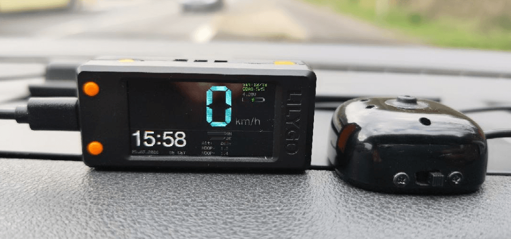
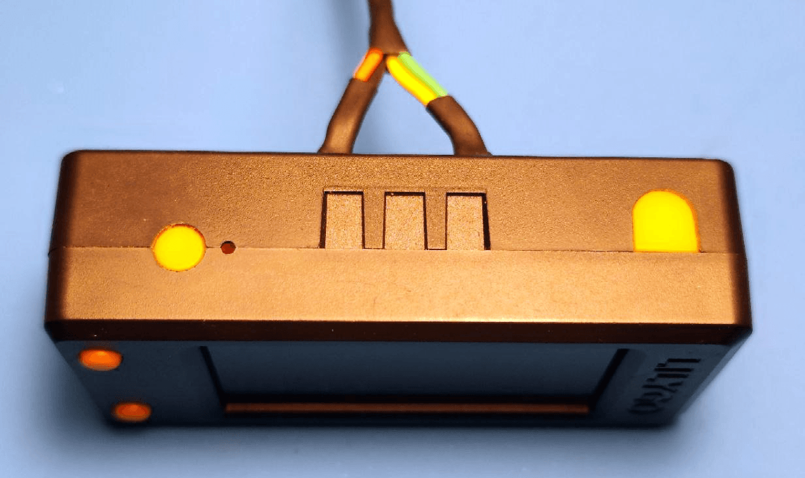
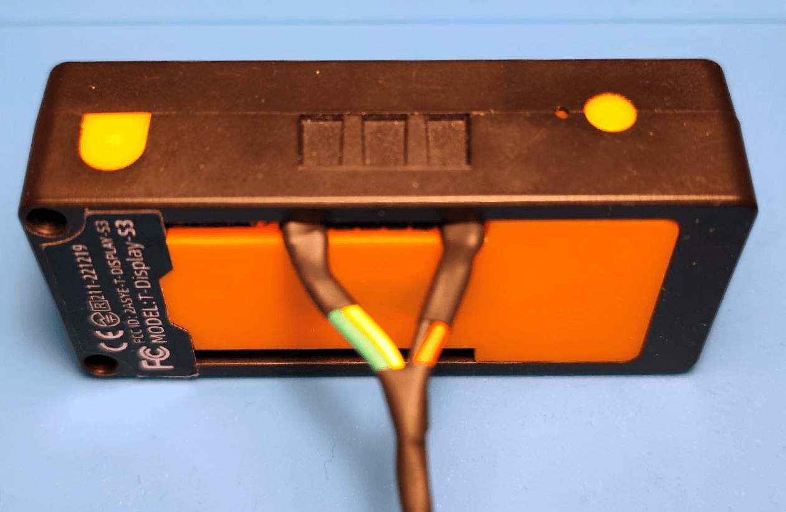
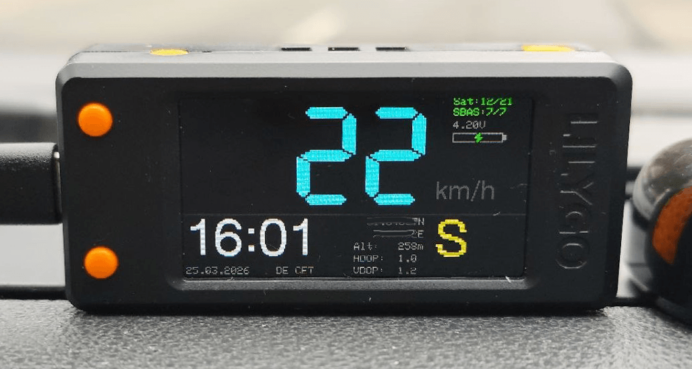
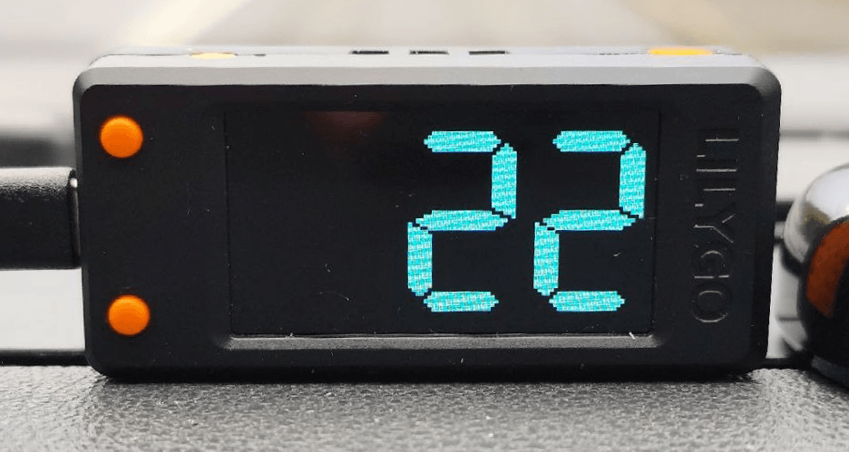
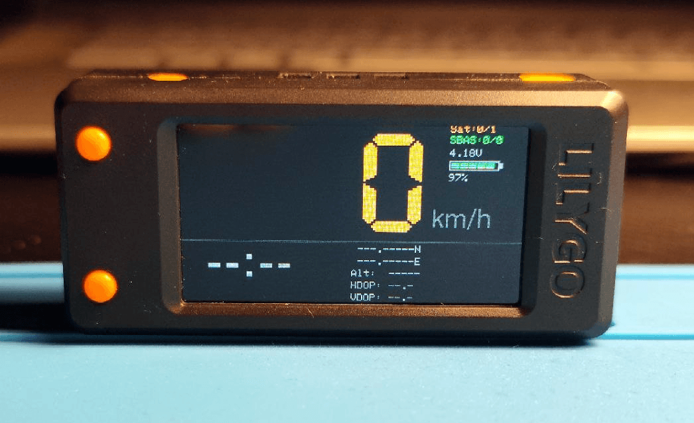
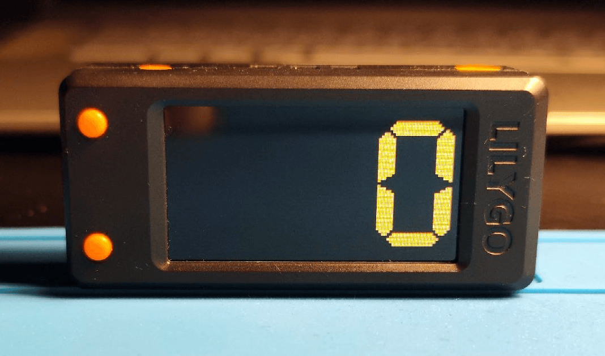
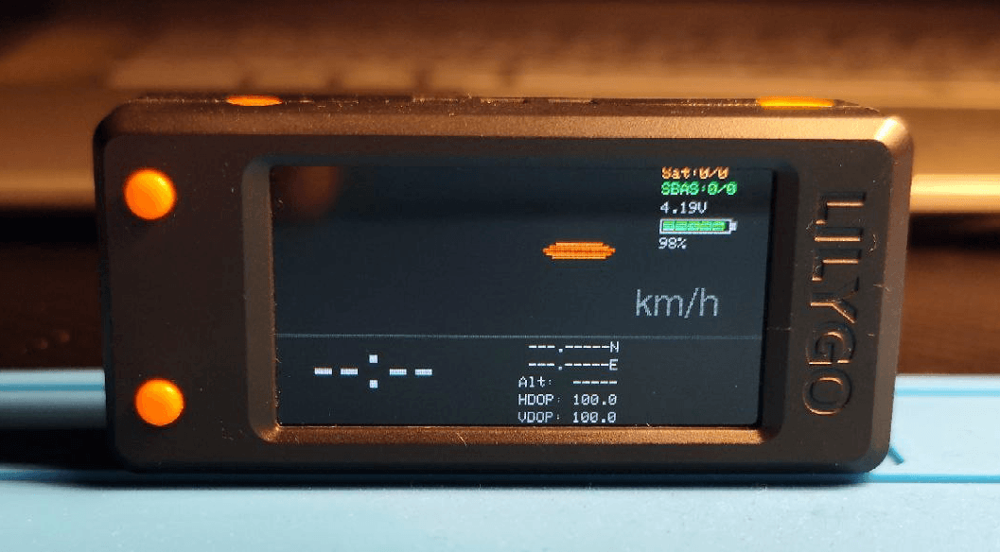

# ESP GPS Speedometer with Auto Timezone — LilyGO T-Display-S3 + u-blox NEO-M10

A GPS-based speedometer for the **LilyGO T-Display-S3** (ESP32-S3) that automatically determines local time and timezone from GPS coordinates — **no internet, no NTP, no RTC required**.



---

## Overview

The device receives NMEA data from a **u-blox NEO-M10** GPS module, displays speed in real time on the built-in ST7789V display (320×170 px), and shows local time with automatic DST handling for any country in the world.

Timezone data is stored entirely in ESP32 Flash as a pre-generated PROGMEM lookup table built from the [timezone-boundary-builder](https://github.com/evansiroky/timezone-boundary-builder) dataset using the included Python toolchain.

---

## Features

- **Real-time speedometer** — km/h or mph, median-filtered, outlier-rejected
- **Auto timezone** — GPS-coordinate polygon lookup, DST-aware for all ~600 IANA zones
- **Local time + date** — 12/24h, correct from the first GPS fix, no NTP
- **Satellite status** — used/visible counts for GNSS and SBAS/EGNOS
- **HDOP + VDOP** — dilution of precision from GGA + GSA sentences
- **Night mode** — auto dimming based on calculated sunrise/sunset
- **Battery monitor** — ADC-based with calibration, percentage + voltage display
- **Deep sleep** — manual (button hold) and automatic (low battery)
- **Warm start** — last position + time saved to NVS; sent to GPS on wake for fast TTFF
- **Two screen modes** — full info panel (Screen 1) / fullscreen speed digits (Screen 2)

---

## Hardware

| Component | Details |
|---|---|
| MCU / Display | LilyGO T-Display-S3 (ESP32-S3, ST7789V 320×170) |
| GPS | u-blox NEO-M10 (NEO-M10-1-10) |
| GPS TX → ESP32 | GPIO 18 (UART1 RX) |
| GPS RX → ESP32 | GPIO 17 (UART1 TX) |
| GPS power | 3.3 V |
| Backlight | GPIO 38 (LEDC PWM) |
| Display power enable | GPIO 15 |
| Battery ADC | GPIO 4 (×2 voltage divider) |
| Sleep button | GPIO 0 (BOOT) — hold to sleep |
| Wake button | GPIO 14 (KEY) — wake from deep sleep / toggle Screen 2 |

### Connection Method

The LilyGO T-Display-S3 was chosen for the device, featuring a proprietary plastic case with dedicated pins on the rear panel. For convenience, a battery was also added to the center of the case for battery-powered operation when the engine is off.





---

## Repository Structure

```
gps_speedometer.ino      Main Arduino sketch
country_profiles.h       Home-location table for GPS warm-start hints
timezone_data.h          Auto-generated PROGMEM timezone polygons + metadata
timezone_lookup.h        Coordinate → timezone lookup algorithm (header-only)
scripts/convert.py               Step 1 — download & enrich timezone GeoJSON
scripts/compress.py              Step 2 — convert GeoJSON → Arduino .h files
```

---

## Arduino Usage

### Include Order

```cpp
#include "timezone_data.h"   // FIRST — defines TzZone, TZ_ZONES, TZ_POINTS, PROGMEM stubs
#include "timezone_lookup.h" // SECOND — defines tz_lookup()
```

### Lookup API

```cpp
// Signature
TzResult tz_lookup(float lat, float lon,
                   uint16_t year, uint8_t month, uint8_t mday,
                   uint8_t hour, uint8_t minute);

// Example — Berlin, summer 2026
TzResult r = tz_lookup(52.52f, 13.405f, 2026, 6, 15, 10, 0);

if (r.valid) {
    Serial.println(r.country);       // "DE"
    Serial.println(r.tzid);          // "Europe/Berlin"
    Serial.println(r.abbr);          // "CEST"
    Serial.println(r.utc_offset_h);  // 2.0
    Serial.println(r.is_dst);        // 1
}

// Example — Kolkata (fractional offset: UTC+5:30)
TzResult r2 = tz_lookup(22.57f, 88.36f, 2026, 1, 15, 8, 0);
// r2.abbr = "IST", r2.utc_offset_h = 5.5
```

### Result Structure

```cpp
typedef struct {
    uint8_t valid;          // 1 = found, 0 = coordinates outside all zones
    char    country[4];     // ISO 3166-1 alpha-2, e.g. "DE"
    char    tzid[40];       // IANA identifier, e.g. "Europe/Berlin"
    char    abbr[10];       // Abbreviation, e.g. "CEST"
    float   utc_offset_h;   // Current UTC offset in hours (includes DST)
    uint8_t is_dst;         // 1 if DST is active
} TzResult;
```

---

## Configuration

Edit the top of `gps_speedometer.ino` before compiling:

```cpp
// Units
#define LOCALE_METRIC    true   // true = km/h + m | false = mph + ft
#define LOCALE_USE_24H   true   // true = 24h clock | false = AM/PM
#define DISPLAY_ROTATION 180    // 0 = normal | 180 = upside-down mount

// Home country for GPS warm-start hint
#define COUNTRY_CODE     DE     // Any code listed in country_profiles.h,
                                // or CUSTOM to use your own coordinates

// GPS
#define GPS_UPDATE_HZ    5      // Navigation rate (1–10 Hz)
#define FIX_HDOP_MAX     2.0f   // Max HDOP to accept as a valid fix
#define FIX_SATS_MIN     4      // Min satellites for a valid fix

// Battery thresholds (%)
#define BAT_WARN_PCT     40
#define BAT_LOW_PCT      20
#define BAT_CRIT_PCT     10
#define BAT_SLEEP_PCT    5      // Auto sleep below this level
```

### Adding or editing home locations — `country_profiles.h`

The file contains the `CountryProfile` struct and the `COUNTRY_PROFILES[]` table.
Each entry has four fields: `code`, `homeLat`, `homeLng`, `homeAlt`.

```cpp
// country_profiles.h — excerpt
struct CountryProfile {
  const char* code;
  float       homeLat;
  float       homeLng;
  float       homeAlt;   // metres
};
```

To add a new entry or change the `CUSTOM` coordinates, edit `country_profiles.h`
directly — no changes to the main sketch are needed.
EGNOS/SBAS is always enabled unconditionally; there is no per-country SBAS flag.

---

## Modes

### Operating Mode

There are two screens available: a general screen with all the information and, by pressing a button, you can switch to numbers only.






### Search Mode

While searching for satellites, the speed and number of satellites are displayed in orange. The u-blox NEO-M10 uses a maximum of 12 satellites to determine its position.





### Error identification

If the GPS module is not connected or returns incorrect values, a red line is displayed at the end of the grace period.



---

## Libraries

Install via Arduino Library Manager or PlatformIO:

| Library | Purpose |
|---|---|
| `TFT_eSPI` | ST7789V display driver — configure with `Setup206_LilyGo_T_Display_S3.h` |
| `TinyGPS++` | NMEA sentence parsing |
| `Preferences` | NVS read/write for warm-start cache |

---

## Data Encoding

`timezone_data.h` stores coordinates as `int16_t` scaled by ×100:

- Coordinate precision: ~1.1 km at the equator
- UTC offset precision: supports fractional zones (India +5:30 → `550`, Nepal +5:45 → `575`)
- DST rules: encoded as `uint8_t[5]` = `{month, week, dow, hour, minute}` in POSIX `Mm.w.d/hh:mm` format
- Ring separator: sentinel value `(32767, 32767)` between polygon rings within one zone
- All data in `PROGMEM` (Flash), not RAM

---

## Battery Calibration

Send a calibration command over Serial (115200 baud) to refine ADC readings:

```
CAL:2.80,3.30;3.10,3.55;3.35,3.75;3.55,3.86;3.78,4.13;3.92,4.20
```

Format: `CAL:raw_adc_v,real_v;raw_adc_v,real_v;...` (minimum 2 points). Values are stored in NVS and survive reboot.

---

## License

MIT — see `LICENSE` for details.

---

## Acknowledgements

- [timezone-boundary-builder](https://github.com/evansiroky/timezone-boundary-builder) — Evan Siroky — timezone polygon data
- [TinyGPS++](https://github.com/mikalhart/TinyGPSPlus) — Mikal Hart
- [TFT_eSPI](https://github.com/Bodmer/TFT_eSPI) — Bodmer
